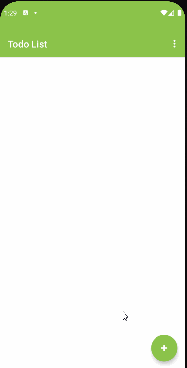

# Simple Todo App
This is a simple todo app. It can add, delete and update task. Task contains task name, due date, priority, and completion status.
The guideline of using app is detailed below.

# App Demo
Showing basic app use. Add, update, and delete task.

## 1. Starting app
On clicking the app, a splash activity opens that shows fullscreen display and app logo.

***
***
## 2. User Login
User can login to the app using the username and password. For now, username and password is set to <i>user</i>.

### a. Bad credential fields
<table>
  <tr>
    <td>If username left empty, an error message is shown.</td>
     <td>If password left empty, an error message is shown.</td>
     <td>If credentials did not match</td>
  </tr>
  <tr>
    <td></td>
    <td></td>
    <td></td>
  </tr>
 </table>

***
***
## 3. Task Functions
Tasks can be added, updated, and deleted through different ways.

###  a. Add task
On clicking the + button, a fragment containg options will be displayed.
Options contains task title,  calender to set date.priority High, Medium or Low
On clicking save button (Up arrow), the task is created and shown in task list.

#### b. Calendar Today, Tomorrow, Next Week Chips
On clicking any of the chips, the due date is set to respective date.
<table>
  <tr>
    <td>Set date to today.</td>
     <td>Set date to tomorrow.</td>
     <td>Set date to next week.</td>
  </tr>
  <tr>
    <td></td>
    <td></td>
    <td></td>
  </tr>
 </table>

### c. Update task
Task can be edited either by clicking on task or by swiping right.
<table>
<tr>
<td>Update by clicking on task</td>
<td>Update by swiping right</td>
</tr>
<tr>
<td></td>
<td></td>
</tr>
</table>

### d. Delete single task
Task can be deleted either by clicking on radio button present or by swiping left.
<table>
<tr>
<td>Delete by clicking on task</td>
<td>Delete by swiping left</td>
</tr>
<tr>
<td></td>
<td></td>
</tr>
</table>

### e. Delete all tasks and delete completed
All tasks can be deleted at once. Also all completed task can be deleted.
<table>
<tr>
<td>Delete Completed Tasks</td>
<td>Delete All Tasks</td>
</tr>
<tr>
<td></td>
<td></td>
</tr>
</table>

### f. Share Task
Task details can be shared through the share button. On clicking the button, a popup appears shows options of sharing details.

## 4. Save data on rotation
Data is saved when device rotates.

***
***